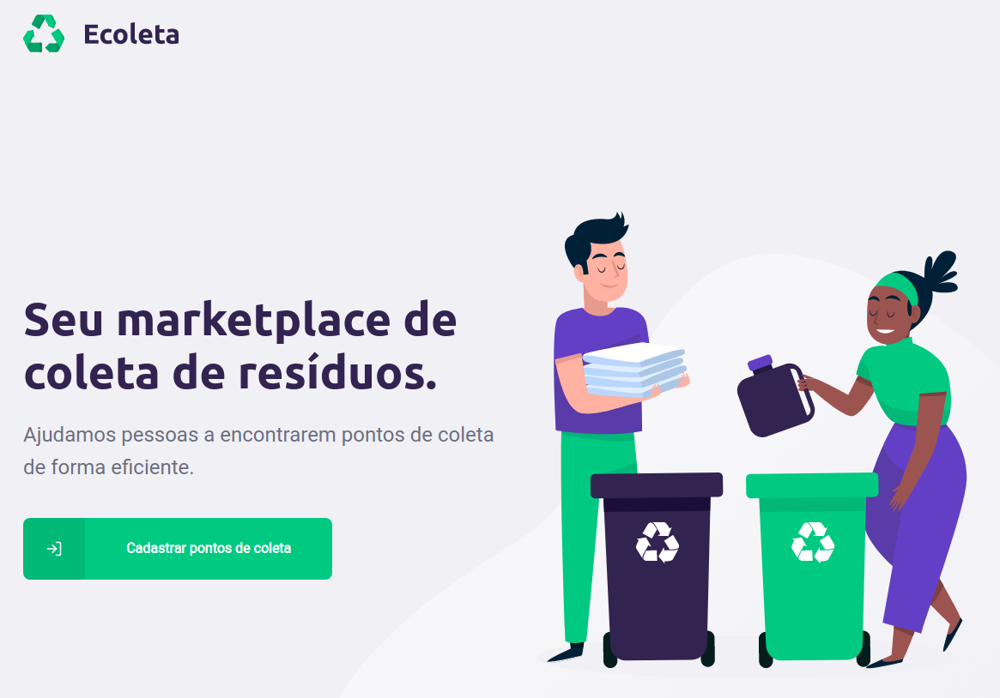

<h1 align="center">
    
</h1>

<p align="center">
  

  
	
  <a href="https://www.linkedin.com/in/larissaiurk/">
    
  </a>

  <a href="https://github.com/larissaiurk/rocketseat-next-level-week-1/commits/master">
    
  </a>

  <a href="https://github.com/larissaiurk/">
    
  </a>  
</p>
<p align="center">
<a href="https://insomnia.rest/run/?label=Ecoleta%20API&uri=https%3A%2F%2Fraw.githubusercontent.com%2Flarissaiurk%2Frocketseat-next-level-week-1%2Fmaster%2Fserver%2Finsomnia.json" target="_blank"></a>
</p>

## :green_heart: Projeto Ecoleta ♻

O projeto Ecoleta, é um market place de estabelecimentos que te ajuda a encontrar pontos de coleta de resíduos de forma eficiente. Esse projeto foi ministrado pelo mestre [Diego Fernandes](https://www.linkedin.com/in/diego-schell-fernandes/), no bootcamp <strong>Next Level Week #1 </strong> da [Rocketseat](https://www.youtube.com/channel/UCSfwM5u0Kce6Cce8_S72olg).

<h1 align="center">
    
</h1>


## :rocket: Tecnologias

O projeto utilizou as seguintes tecnologias:

- [Node.js][nodejs]
- [TypeScript][typescript]
- [React][reactjs]
- [React Native][rn]
- [Expo][expo]

## :information_source: Como usar esse repositório

Basta clonar o repositório e instalar as dependências.

Você vai precisar do [Git](https://git-scm.com), [Node.js][nodejs] + [Npm][npm].

No seu terminal:

### Install API 

```bash
# Clonar o repo
$ git clone https://github.com/larissaiurk/rocketseat-next-level-week-1

# Entrar no repo
$ cd rocketseat-next-level-week-1/server

# Instalar dependências
$ npm install

# Rodar Migrates
$ npm run knex:migrate

# Rodar Seeds
$ npm run knex:seed

# Copie o arquivo .env e Configure sua url e porta para o servidor
$ cp .env.example .env

# Rodar o servidor
$ npm run dev

```

### Install Front-end

```bash
# Clonar o repo
$ git clone https://github.com/larissaiurk/rocketseat-next-level-week-1

# Entrar no repo
$ cd rocketseat-next-level-week-1/web

# Instalar dependências
$ npm install

# Rodar
$ npm start

```

### Install Mobile

```bash
# Clonar o repo
$ git clone https://github.com/larissaiurk/rocketseat-next-level-week-1

# Entrar no repo
$ cd rocketseat-next-level-week-1/mobile

# Instalar dependências
$ npm install

# Rodar
$ npm start

# Quando abrir, baixe o aplicativo Expo, escaneie o QR CODE

# Se tiver problemas com fonte, executar:
$ expo install expo-font @expo-google-fonts/ubuntu @expo-google-fonts/roboto

```

---

Feito com ❤️ por Larissa Iurk

[npm]: https://www.npmjs.com/get-npm
[nodejs]: https://nodejs.org/
[typescript]: https://www.typescriptlang.org/
[expo]: https://expo.io/
[reactjs]: https://reactjs.org
[rn]: https://facebook.github.io/react-native/
